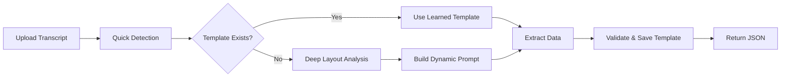

Here’s a cleaned-up version of the README content without any emoji. You can replace your current README with this.

***

# AIRR Transcript Parser - Gemini Vision API

AI-powered transcript extraction system with self-learning templates using Gemini 2.0 Flash + N8N + Supabase


## What It Does

Automatically extracts structured JSON data from student transcript images (any university format) using:
- Gemini 2.0 Flash Vision for multimodal OCR and structured extraction
- Self-learning template system that improves accuracy over time
- N8N workflow automation for the processing pipeline
- Supabase for template storage and retrieval

## Quick Start (< 15 minutes)

### Prerequisites

- Node.js 18+ and npm  
- Docker and Docker Compose  
- Supabase account (free tier works)  
- Google AI Studio API key (from Google AI Studio)[1][2]

### 1. Clone Repository

```bash
git clone https://github.com/yourusername/airr-transcript-parser.git
cd airr-transcript-parser
```

### 2. Setup Supabase Database

```bash
# Copy schema to Supabase SQL Editor and run
cat supabase/schema.sql

# Or use Supabase CLI
supabase db push
```

### 3. Configure Environment

```bash
cp .env.example .env
# Edit .env with:
# GEMINI_API_KEY=your_google_ai_key
# SUPABASE_URL=your_project_url
# SUPABASE_ANON_KEY=your_anon_key
# SUPABASE_SERVICE_KEY=your_service_role_key
```

### 4. Start N8N

```bash
docker-compose up -d
```

### 5. Import Workflow

1. Open http://localhost:5678  
2. Go to Workflows → Import from File  
3. Select `n8n/airr-transcript-parser.json`  
4. Update credentials in nodes (Gemini API key, Supabase keys)

### 6. Test It

- Open: `http://localhost:5678/form/airr-upload`  
- Upload a transcript image (PNG/JPG)  
- View the extracted JSON in the response

## Project Structure

```text
airr-transcript-parser/
├── n8n/
│   ├── airr-transcript-parser.json    # Main N8N workflow
│   └── README.md                      # Workflow documentation
├── supabase/
│   ├── schema.sql                     # Database schema
│   ├── migrations/                    # Migration files
│   └── seed.sql                       # Sample data (optional)
├── docs/
│   ├── ARCHITECTURE.md                # System design
│   ├── API.md                         # API documentation
│   └── DEMO.md                        # Demo guide
├── examples/
│   ├── transcripts/                   # Sample transcript images
│   └── outputs/                       # Example JSON outputs
├── docker-compose.yml                 # N8N container setup
├── .env.example                       # Environment template
└── README.md                          # This file
```

## Architecture



### Workflow Steps

1. Upload Transcript – form trigger accepts image files  
2. Quick Detection – Gemini identifies university and layout type[2]
3. Template Matching – Supabase lookup for existing templates (score ≥ 70)  
4. Path A: Use Template – apply learned extraction prompt  
5. Path B: Dynamic Analysis – layout analysis and custom prompt generation  
6. Validation – check extracted data completeness  
7. Learning – save successful new prompts as templates  
8. Output – return structured JSON

## Output Schema (Example)

```json
{
  "studentinfo": {
    "STUDENT NAME": { "value": "John Doe" },
    "major": { "value": "Computer Science" }
  },
  "collegeInfo": {
    "INSTITUTION NAME": { "value": "MIT" }
  },
  "academicrecord": [
    {
      "termDetails": [
        { "monthYear": { "value": "Fall 2022" } }
      ],
      "courseDetails": [
        {
          "course_id": { "value": "CS101" },
          "course_name": { "value": "Intro to Programming" },
          "credits_earned": { "value": "3" },
          "grades": { "value": "A" }
        }
      ]
    }
  ],
  "gpaSummary": {
    "calculated_col_gpa": { "value": "3.85" }
  }
}
```

## What Works

- Multi-university transcript parsing (multiple formats)  
- Automatic template learning and reuse  
- Gemini 2.0 Flash vision-based extraction[3][2]
- Nested JSON structure generation matching a strict schema  
- Template matching with simple scoring logic  
- Supabase RPC for matching templates  
- Form-based upload interface in N8N  
- Basic error handling and validation

## Known Limitations

- Multi-page transcripts: currently assumes a single page  
- Limited testing on non-Latin scripts  
- Not designed for handwritten transcripts  
- Complex nested table layouts may need manual review  
- Template versioning not implemented

## What Was Cut (Scope Reduction)

- Custom frontend UI (N8N form used instead)  
- Authentication and user management  
- Batch processing of multiple files  
- Real-time preview UI  
- Visual template management interface

## Next Steps / Roadmap

### Phase 2

- Multi-page PDF support  
- Confidence score per extracted field  
- Template versioning  
- Webhook notifications

### Phase 3

- Custom field mapping UI  
- Export to CSV and PDF  
- Template sharing mechanisms  
- SIS integrations  
- Optional fine-tuning for specific universities

## Demo Video

Add a link here after recording, for example:

`[Watch 5–8 minute demo](https://youtu.be/your-demo-link)`

Suggested sections:
1. Uploading a transcript and first parse
2. Template creation and reuse
3. Different university format handling
4. Supabase templates overview

## Development

### Running Locally

```bash
docker-compose up -d
```

### Testing

```bash
curl -X POST http://localhost:5678/webhook/airr-upload \
  -F "transcript=@examples/transcripts/sample.png"
```

### Database Migrations (if using Supabase CLI)

```bash
supabase migration new add_feature_name
supabase db push
```

